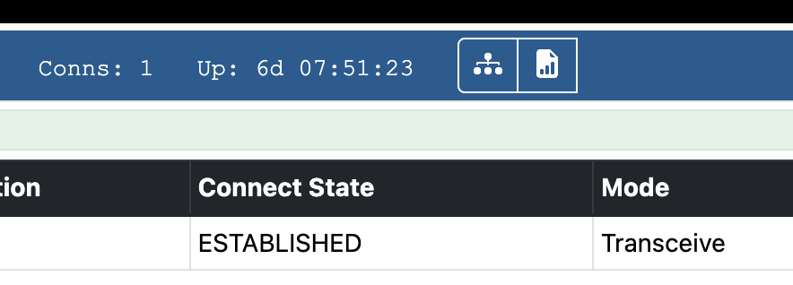

+++
title = "Custom CSS Allmon3"
image = "hide-buttons.png"
date = "2025-10-15"
+++

Custom CSS for Allmon3.

<!--more-->

This will hide the node control buttons for people that are logged out

```
body.logged-out .node-bi:nth-child(n + 3) {
        display:none;
}
```


