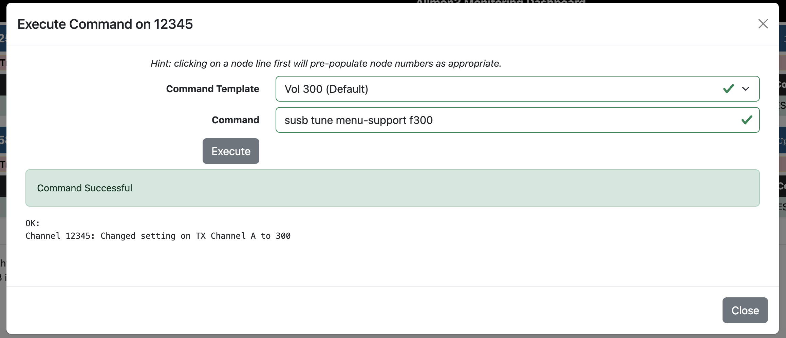

+++
title = "Volume Via Allmon3"
image = "allmon3-volume-commands.png"
date = "2025-10-10"
+++

This HOWTO will show how to control TX volume direct from Allmon3 UI with no modifications to core files.

<!--more-->

You will need version of [1.6.1](https://github.com/AllStarLink/Allmon3/releases/tag/1.6.1-1) of Allmon3 for this to work which was released Oct 7th 2025

In this example we will assume your TX volume in simple-usb-tume is set to **300**.

TX audio is what we **hear** from the radio, it is **not** your keyed up audio.

We will add a way to change to different levels on the go, without dropping connection or disrupting an active QSO!

Log into your node via SSH, this will vary depending on how you setup your node. You may even have an SSH client already setup if using the cockpit appliance.

Now open the Allmon3 config file `/etc/allmon3/web.ini` we will add some items to the `[syscmds]` stanza.

There are a lot of commands you will never need here, so now is a good time to comment out the ones you do not need.

You can also add these commands to specific nodes `[syscmds-12345]` will only show the commands on node 12345 for example.

`sudo nano -wl /etc/allmon3/web.ini`

Insert the following:

```
susb tune menu-support f50 = Vol 50
susb tune menu-support f100 = Vol 100
susb tune menu-support f200 = Vol 200
susb tune menu-support f300 = Vol 300 (Default)
susb tune menu-support f400 = Vol 400
susb tune menu-support f500 = Vol 500
```
Save the changes with `CTRL+O` then `CTRL+X`.

Now restart the allmon3 service with `sudo systemctl restart allmon3`. You should now see your new volume commands!


