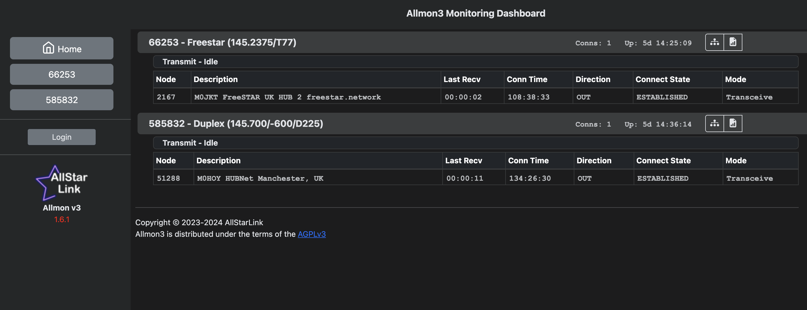

+++
title = "Dark Mode Pure CSS"
image = "dark-mode.png"
date = "2025-10-23"
+++

This CSS adds dark mode to your Allmon3, no other code changes needed!
<!--more-->

Includes a few other tweaks as a base for modifications.

Add to `/etc/allmon3/custom.css`
```
@media (prefers-color-scheme: light) {
	:root{
		/* Background of the top navbar */
		--am3-navbar-background: rgba(248, 249, 250, 1 );
		--am3-navbar-color: rgba(0, 0, 0, 1);
		--am3-nodetitle-color: hsl(228, 5%, 80%);
	}
}

.nodetxline.am3-no-tx {
  color: rgb(195, 230, 203); */
}
.nodetxline {
  margin-bottom: 5px;
}

body.logged-out .node-bi:nth-child(n + 3) {
	display:none;
}
#asl-statmon-dashboard-area td.desc {
	min-width: 300px;
	max-width: 300px;
}

th.node-conn-nokey,
th.node-conn-keyed,
td.node-conn-nokey,
td.node-conn-keyed {
	font-family: 'Nimbus Mono PS', 'Courier New', monospace;
	padding: 6px 0 0 6px;
	font-weight: 700;
	opacity: .8;
}

.numconns-box,
.uptime-box {
	font-family: 'Nimbus Mono PS', 'Courier New', monospace;
	padding-top: 4px;
	font-weight: 700;
	opacity: .8;
}

@media only screen and (max-width: 600px) {
	#asl-statmon-dashboard-area td.desc {
		min-width: unset;
		max-width: unset;
  }
}

.header-banner-img {
	opacity:0;
}

@media (prefers-color-scheme: dark) {
	.sidebar {
		background: rgb(37, 39, 40) !important;
	}
	.sidebar img {
		filter: invert(100%);
	}
	div.rounded {
		border-bottom: none !important;
	}
	.table-bordered {
		border-color: rgb(226, 229, 233) !important
	}
	tbody, td, tfoot, th, thead, tr {
		border-color: #3A3D3E !important;
	}
	.sidebar a,
	#login-out-region button {
		color: rgb(226, 229, 233);
		background: #3A3D3E;
		border-color: #1C1C1D;
	}
	#login-out-region button:hover {
		background: #5C636D;
		border-color: #1C1C1D;
	}
	.nodetxline.am3-no-tx,
	.nodetxline.am3-tx-network,
	.nodetxline.am3-tx-local,
	.nodetxline.am3-tx-telemetry {
		opacity: 1;
		background: #212529 !important;
		border-color: #3A3D3E;
		color: rgb(226, 229, 233) !important;
	}
	.nodetxline.am3-tx-telemetry,
	.nodetxline.am3-tx-network,
	.nodetxline.am3-tx-local {
		background: #3A3D3E !important;
	}

	.nodetxline.am3-tx-local {
		color: red !important;
	}

	:root {
		--bs-body-bg: #1C1C1D;
		--bs-body-color: rgb(226, 229, 233);
		--am3-navbar-background: rgb(37, 39, 40);
		--am3-navbar-color: rgb(226, 229, 233);
		--bs-emphasis-color: rgb(226, 229, 233);
		--am3-nodetitle-color: rgb(226, 229, 233);
		--am3-nodetitle-background: #3A3D3E;
		--bs-table-bg: #3A3D3E !important;
		--bs-table-border-color: rgb(226, 229, 233) !important;
		--bs-border-color: rgb(226, 229, 233) !important;
		--am3-node-tx-local-bg-color: #3A3D3E;
		--am3-node-tx-local-color: #3A3D3E;
		--am3-node-tx-playback-remote-bg-color: #3A3D3E;
		--am3-node-tx-telemetry-bg-color: #3A3D3E
	}
}
```


