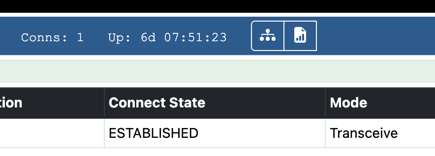

+++
title = "Hide node controls in Allmon3"
image = "hide-buttons.png"
date = "2025-10-15"
+++

 Hide the two node control buttons for logged out users in Allmon3

<!--more-->

Add to `/etc/allmon3/custom.css`
```
body.logged-out .node-bi:nth-child(n + 3) {
        display:none;
}
```


