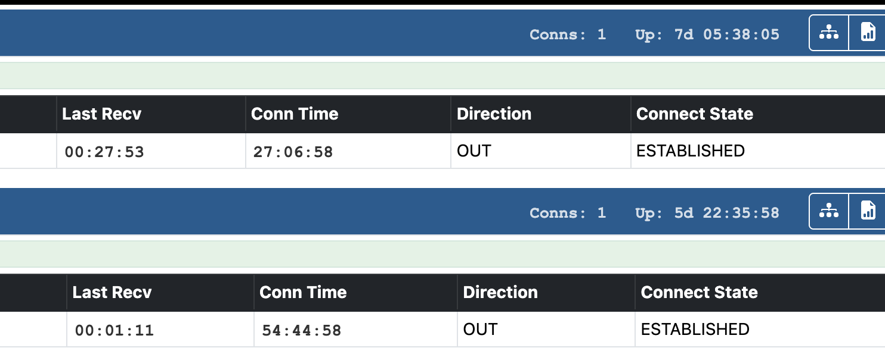

+++
title = "Use terminal style font for time"
image = "terminal-time.png"
date = "2025-10-16"
+++

Using a fixed width terminal font stops the display shifting by single pixels when time goes from 1 to 2 because the number width changes. This is amplified when there are dozens of nodes connected.

<!--more-->

Add to `/etc/allmon3/custom.css`
```
td.lastr,
td.ctime {
    font-family: 'Nimbus Mono PS', 'Courier New', monospace;
    padding: 6px 0 0 6px;
    font-weight: 700;
    opacity: .8;
}
.numconns-box,
.uptime-box {
    font-family: 'Nimbus Mono PS', 'Courier New', monospace;
    padding-top: 4px;
    font-weight: 700;
    opacity: .8;
}
```


